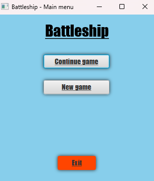
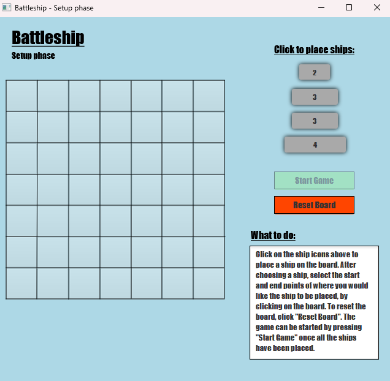
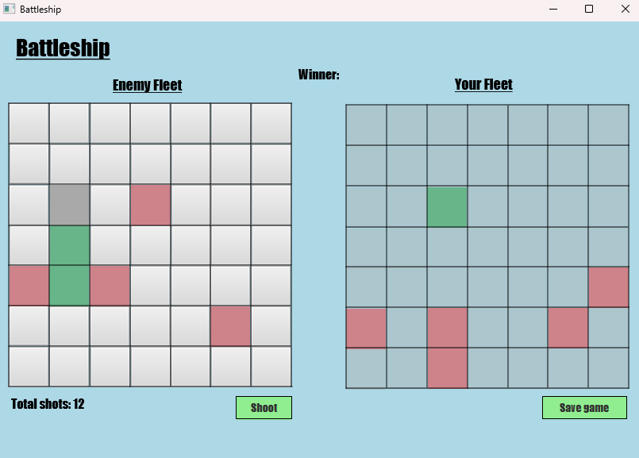

# Battleship

This repo contains a Java project I wrote during the TDT4100 course back in 2022. It is simply a rendition of the well-known Battleship game, made using Java, JavaFX and SceneBuilder.

To run the game, clone the repository and run `mvn clean install` from the root folder. Then simply hit run in the `BattleshipProjectApp` Class under `src/main/java/battleshipProject`.

This should open the game's start screen. From here you play against the computer on either a 7x7 or 10x10 board. Games can be saved locally and continued later on. The first player (or computer) to sink the other's ships wins. To shoot, simply click an available tile and press the shoot button.

The game requires Java/Javac version 17 or higher, and JavaFX version 17.0.13 to run.

## Some screenshots from the game

More details about the game itself and the process of creating it can be found on my [Portfolio page](https://runesee.github.io/projects/battleship.html).
